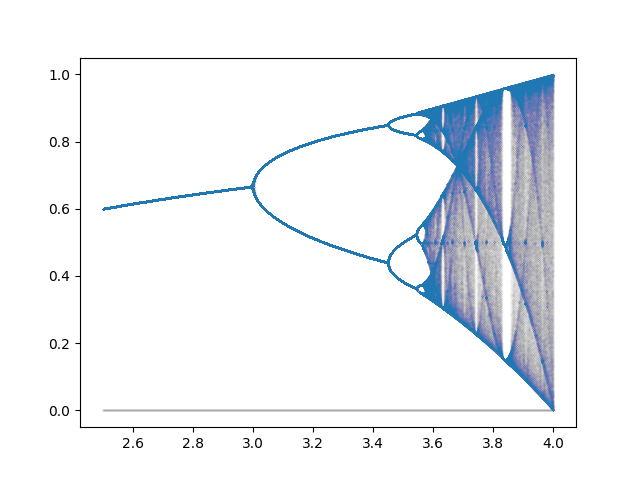

# logistic-map
This is a code repository for some Python code to generate the logistic map. Feel free to use it however you want.

The code is in `logistic_map_grapher.ipynb`.

A graph produced is here:

